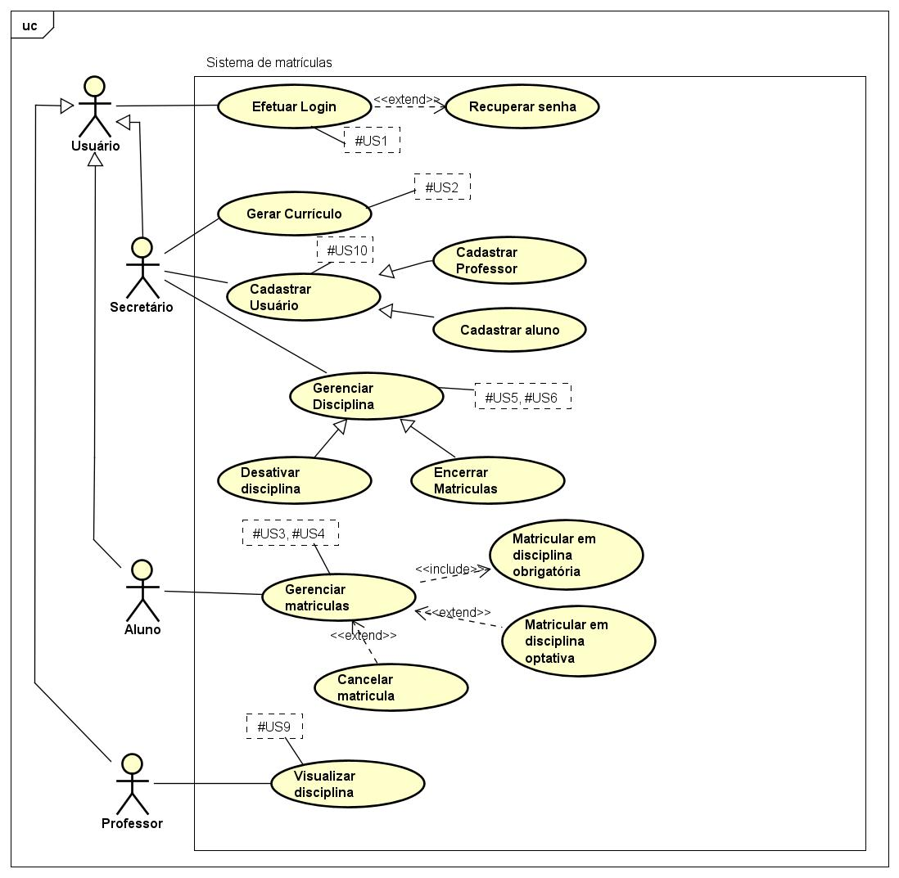

# Sistema de Matrículas da Universidade

## Histórias de Usuário

### #US1. Login no sistema
**Como usuário**,  
gostaria de efetuar o login no sistema utilizando as minhas credenciais, ou recuperar a senha caso tenha a esquecido,  
**para que assim, possa utilizar o sistema.**

### #US2. Geração e Manutenção de Currículo
**Como Secretária**,  
preciso gerar um currículo para cada semestre e manter as informações sobre as disciplinas, professores e alunos,  
**para que os alunos possam se matricular nas disciplinas corretas.**

### #US3. Matrícula em Disciplinas
**Como Aluno**,  
preciso me matricular em 4 disciplinas como 1º opção e em mais 2 outras optativas,  
**para que eu possa cursar as disciplinas necessárias para meu curso.**

### #US4. Cancelamento de Matrícula
**Como Aluno**,  
preciso cancelar matrícula em um determinado período,  
**para ajustar minha grade curricular conforme necessário.**

### #US5. Desativação de Disciplinas com Baixa Matrícula
**Como Secretária**,  
gostaria de desativar uma disciplina caso ela tenha menos de 3 matrículas ao final do semestre,  
**para abrir espaço para outras disciplinas.**

### #US6. Encerramento de Matrículas por Capacidade
**Como Secretária**,  
gostaria de encerrar matrículas para uma disciplina caso esta alcance o limite máximo de 60,  
**para não exceder a capacidade máxima.**

### #US7. Cobrança pela Matrícula
**Como Aluno**,  
gostaria de ser cobrado pelo Sistema de Cobranças pela disciplina na qual me matriculei,  
**para poder pagar a tempo.**

### #US8. Notificação ao Sistema de Cobranças
**Como sistema**,  
gostaria de notificar o Sistema de Cobranças para realizar a cobrança do Aluno matriculado,  
**para que os alunos possam ser cobrados pelas disciplinas nas quais estão matriculados.**

### #US9. Consulta de Matrículas por Professores
**Como Professor**,  
preciso acessar o Sistema para saber quais alunos estão matriculados em minha disciplina,  
**para que eu possa saber quem está inscrito nas minhas aulas.**

### #US10. Cadastro de Alunos e Professores
**Como Secretária**,  
quero cadastrar alunos e professores no sistema,  
**para que eles possam acessar e utilizar o sistema de matrículas.**

